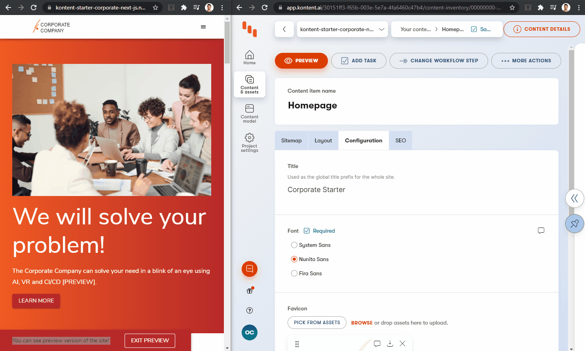

# NESA Digital Curriculum.

**UAT**: [](https://nesa-uat.vercel.app)
**DEV**: [](https://nesa-dev.vercel.app)

This is Digital Curriculum site by NESA using [Next.js](https://nextjs.org) with [Kontent by Kentico](https://kontent.ai) as a [CMS](https://en.wikipedia.org/wiki/Content_management_system). The site is created based on [Kontent Starter Corporate](https://kontent-starter-corporate-next-js.netlify.app) and heavily modified to use Typescript

**Table of contents**

-   [NESA Digital Curriculum](#nesa-digital-curriculum)
    -   [Deploy your own](#deploy-your-own)
    -   [How to run on local](#how-to-run-on-local)
        -   [Environment variables](#environment-variables)
        -   [Connect Kontent project with code base](#connect-kontent-project-with-code-base)
    -   [Content editing development](#content-editing-development)
    -   [About](#about)
        -   [Content model](#content-model)
        -   [Structural types](#structural-types)
        -   [SEO](#seo)
        -   [Layout types](#layout-types)
    -   [Code](#code) - [Sitemap construction](#sitemap-construction) - [Specific route data](#specific-route-data)
        -   [Data builders](#data-builders)
        -   [Content types - React components mapping](#content-types---react-components-mapping)
    -   [Preview](#preview)
        -   [Enter the preview](#enter-the-preview)
            -   [Preview URLs](#preview-urls)
        -   [Exit the preview](#exit-the-preview)
    -   [Publish process and data fetching](#publish-process-and-data-fetching)
        -   [Incremental Static regeneration (ISR)](#incremental-static-regeneration-isr)
        -   [Static](#static)
        -   [_Server-side rendering_](#server-side-rendering)
    -   [Rich text element resolution](#rich-text-element-resolution)
    -   [Design](#design)
    -   [Learn More](#learn-more)
        -   [Related content](#related-content)

## Deploy your own

Once you have access to [the environment variables you'll need](#environment-variables), deploy the example using [Vercel](https://vercel.com?utm_source=github&utm_medium=readme&utm_campaign=next-example):

[](https://vercel.com/new/git/external?repository-url=https://bitbucket.org/nesa1542/digital-curriculum-next&project-name=digital-curriculum-next&repository-name=digital-curriculum-next&env=KONTENT_PROJECT_ID,KONTENT_PREVIEW_API_KEY,KONTENT_MANAGEMENT_API_KEY,PREVIEW_SECRET&envDescription=Required%20to%20connect%20the%20app%20with%20Kontent&envLink=https://bitbucket.org/nesa1542/digital-curriculum-next%23Environment-variables)

## How to run on local

If you want to use Vercel CLI or have already had Vercel CLI installed on your machine, you can simply run `vercel dev`

If not, you can simply run `yarn and yarn dev` after setting up the environment variables

### Environment variables

1. Set up environment variables

    - Copy the `.env.template` file in this directory to `.env` (which will be ignored by Git):

        ```sh
        cp .env.template .env
        ```

2. Run the development server

    ```sh
    yarn dev
    ```

🎉 Open [http://localhost:3000](http://localhost:3000) with your browser to see the result.

> By default, the content is loaded from a shared Kontent project. If you want to use your own clone of the project so that you can customize it and experiment with Kontent, continue to the next section.

|          Variable          | Required | Description                                                                                                                                           |
| :------------------------: | :------: | :---------------------------------------------------------------------------------------------------------------------------------------------------- |
|     KONTENT_PROJECT_ID     |   YES    | Project identification described in the [Setup section](#connect-kontent-project-with-code-base)                                                      |
|  KONTENT_PREVIEW_API_KEY   |   YES    | Project key allowing to load non-published content described in the [Setup](#connect-kontent-project-with-code-base) and [Preview](#preview) sections |
| KONTENT_MANAGEMENT_API_KEY |   YES    | Project key allowing to manage content through the Management SDK. It's mainly used for getting assets and taxonomies in this project                 |
|       PREVIEW_SECRET       |   YES    | A key securing the preview content access via application described in [Preview entering section](#enter-the-preview)                                 |

### Connect Kontent project with code base

1. Set env variables on `.env`:
    - `KONTENT_PROJECT_ID` - Should be the Project ID in `Project settings` > `API keys`.
    - `KONTENT_PREVIEW_API_KEY` - Should be the Preview API key in `Project settings` > `API keys`. Set this value if you want to see non-published content. If you need a more complex setup, jump to the [Preview section](#Preview).

## Content editing development

Run the development server:

```sh
npm run dev
# or
yarn dev
```

🎉 Open [http://localhost:3000](http://localhost:3000) with your browser to see the result.

You can start editing the page by modifying content in Kontent project. The page auto-updates as you edit the content. If you don't have `KONTENT_PREVIEW_API_KEY` specified, you need to [publish the changes](https://kontent.ai/learn/tutorials/write-and-collaborate/publish-your-work/publish-content-items) in order to see the changes on site.

## About

This section describes the application from the data modeling point of view as well as application architecture approach.

### Content model

Content is modeled to be ready for being used in the [Web Spotlight](webspotlight.kontent.ai). Web spotlight is not turned on by default intentionally, because this starter should also serve to the users without the feature on.

> For a better idea of how the relationship between each of the content models, check out the [content type relationships graph](./docs/content-types-relations.png).

### Structural types

The structure of the model is defined by linked items element called "Subpages"

-   Homepage - also stores configuration data like site logo, header and footer menus or social networks information (it works like a master page + config)

### SEO

SEO information is [modeled as a content type snippet called "SEO"](https://kontent.ai/learn/tutorials/develop-apps/optimize-your-app/seo-friendly-content#a-metadata-in-caas).

This snippet is placed as a part of [structural types](#structural-types). Every sitemap entry (the content item based on structural types and a `post`) allows specifying SEO metadata. This metadata is used in a [custom App components (`_app`)](https://nextjs.org/docs/advanced-features/custom-app) component to be rendered on the page.

### Layout types

The content types for these are the ones whose name prefixed with `🌐 WEB PAGE` and whose codename prefixed with `wp_`. The layouts are specified in [layouts](./layouts/). Each layout type (web page) is expected to have `web_content_rtb__content` field (from `📜 Rich Text Box Web Content` Snippet)

Syllabus is the exception since syllabus page is generated from `Syllabus` content.

## Code

The application is using Next.js [Catch all route](https://nextjs.org/docs/routing/dynamic-routes#catch-all-routes) to handle all of the routes. The logic is centralized in [`pages/[[...slug]].tsx`](./pages/[[...slug]].tsx).

> #### ⚠ Benefits and drawbacks
>
> ##### Benefits
>
> Described [sitemap construction](#sitemap-construction) and [configuration loading from Home Page structural type](#structural-types) suits better for projects being built from scratch. In these situations, you need to have the sitemap and configuration (pallette, font, etc.) flexible and easily manageable from the headless CMS without necessity to change the code. This gives you flexibility to spin up the website and configure the project with No Code.
>
> [](https://www.headlesscreator.com/how-to-spin-up-a-nextjs-project-with-no-code)
>
> 
>
> ##### Drawbacks
>
> This approach requires to make 2 requests per route to reload `Mappings` and `Config` objects. This additional work takes a couple of seconds for the development environment to spin up. For the production build, the results are still fast enough.
>
> If you already know the configuration values and the sitemap structure, it is better to use [Next.js dynamic routes](https://nextjs.org/docs/routing/dynamic-routes) showcased in [Next.js Kontent blog repository](https://github.com/vercel/next.js/tree/canary/examples/cms-kontent#readme), but the approach used for [RichText links resolution](#rich-text-element-resolution), [Preview URLs](#preview-urls) and [Web Spotlight setup](#turn-on-web-spotlight) has to be adjusted to respect this new way of routing.

#### Sitemap construction

Internally it uses `getSitemapMappings` method which loads "homepage" item and its child items to the specific depth and then traverses down. This process creates a mapping between the sitemap (routes) and the content items storing data for the specific route.

One example item from the sitemap mappings:

```js
{
  "params": {
    "pageTitle": "Stages",
    "slug": [
      "stages"
    ],
    "navigationItem": {
      "codename": "stages_90cce0a",
      "collection": "default",
      "id": "90cce0a1-e74f-4f35-9e87-a49f518805a2",
      "language": "default",
      "lastModified": "2022-06-30T03:53:32.3423637Z",
      "name": "📂 Stages",
      "sitemapLocations": [],
      "type": "wp_stages",
      "workflowStep": "published"
    },
    "contentItem": {
      "images": [],
      "linkedItemCodenames": [],
      "linkedItems": [],
      "links": [],
      "name": "📜 Content",
      "type": "rich_text",
      "value": "<p>No page view in current designs.</p>\n<p>Autogenerate a list of tile links to subpages?</p>"
    }
  }
}
```

#### Specific route data

For every single route, Next.js is loading data using the `getPageStaticPropsForPath` method. Internally, it reloads the site structure via `getSitemapMappings` method and then identifies the content items to load the data. Then loads the data using Delivery client and passes them as the _Next.js_ `props` to the Next.js processing.

Static props returned from `getPageStaticPropsForPath`:

The common structure of page props is defined in `CommonPageProps` [types/index.ts](types/index.ts)
| Name | Description |
|---|---|
| mappings | It contains mappings for each item that is in subpages. See `getSitemapMappings` [lib/api.ts](lib/api.ts) |
| config | It contains the "master page" data such as logo, header/footer menu, etc
| pageResponse | It contains data specifically for the page loaded
| params | Params passed by getStaticProps
| preview | Tells whether you're in preview mode or not

The data passed as **Next.js** `props` are then populated in `_app.js` and other components in the component tree.

> Currently, the sitemap is reloaded for every request. The following approach was selected because there is currently no way to pass more information than just a path from `getStaticPaths` to `getStaticProps`. See [the official Next.js GitHub discussion comment](https://github.com/vercel/next.js/issues/10933#issuecomment-598297975) for more information.
> It is possible to extend the implementation with the caching, this approach is about to be application specific, so it is not part of the starter.

### Data builders

If a page doesn't have specific requirements to load on the page and just basically rely on the page's `web_content_rtb__content`, the data will be built automatically. However, if additional data is needed, then some adjustments are needed on the returned data. That's where the `databuilders` are for. Add a Typescript file named with the content type name in the `databuilders` folder and also specify it in the `databuilders/index.ts`.

A data builder needs (find the spec in [`databuilders\index.ts`](databuilders\index.ts))
| Function name | Description |
|---|---|
| buildData | To add additional data in the `data` (see [Specific route data](#specific-route-data)) property returned in the json |
| getPageResponse (optional) | Function that returns `Responses.IViewContentItemResponse<IContentItem>` which is used to set the `pageResponse` (see [Specific route data](#specific-route-data)). If not specified, the `pageResponse` is set by `getDefaultPageResponse` in [`databuilders\index.ts`](databuilders\index.ts)

### Content types - React components mapping

Application is using the codename of the content type to load proper react component and render it. If the application does not find the proper component, it fails or displays [special UnknownComponent](./components/UnknownComponent.tsx) in case of development environment.

```tsx
const contentType = props.data.pageResponse.item.system.type

const PageLayout = pageLayouts[contentType]

if (process.env.NODE_ENV === 'development' && !PageLayout) {
	console.error(
		`Unknown Layout component for page content type: ${contentType}`,
	)
	return (
		<UnknownComponent {...props} useLayout={true}>
			<p>Unknown Layout component for page content type: {contentType}</p>
		</UnknownComponent>
	)
}

if (isNotProduction && !preview) {
	return null
}

return <PageLayout {...props} />
```

## Preview

Next.js offers embedded possibility to preview unpublished content - [the preview mode](https://nextjs.org/docs/advanced-features/preview-mode). This feature is integrated with [Kontent preview](https://kontent.ai/learn/tutorials/develop-apps/build-strong-foundation/set-up-preview) in this starter. Once the preview is enabled, all api calls are performed to the [Kontent Preview endpoints](https://kontent.ai/learn/reference/delivery-api#section/Production-vs.-Preview).

There are two Next API routes - `/api/preview` and `/api/exit-preview` - that works as described in [Next.js docs](https://nextjs.org/docs/advanced-features/preview-mode).

### Enter the preview

To enter the preview, just access `/api/preview` API route with the preview secret you set in your [environment variables](#environment-variables).

`http://localhost:3000/api/preview?secret=PREVIEW_SECRET`

Once your secret is verified, you will be redirected to home page and you could see non-published content and the toolbar that allows you to exit the preview.


#### Preview URLs

Kontent [offers a possibility to set the preview URLs for the content types](https://kontent.ai/learn/tutorials/develop-apps/build-strong-foundation/set-up-preview#a-set-up-content-preview-in-your-project). The starter (`/api/preview` route) is already prepared to consume this preview URLs for [structural types](#structural-types) and for the `Post` content type.

To allow that for your project, just set the Preview URLs for `Navigation item`, `Homepage`, and `Post` content type to (fill values in angle brackets):

```plain
https://<YOUR-HOST-DOMAIN>/api/preview?secret=<PREVIEW_SECRET>&redirectItemCodename={Codename}
```

### Exit the preview

Once the preview is enabled a new toolbar pops up on the top of the page. This allows to close the preview (the "EXIT PREVIEW" button leads to the `/api/exit-preview` API route).

## Publish process and data fetching

Next.js provides [multiple ways to fetch the data](https://nextjs.org/docs/basic-features/data-fetching). This starter is mainly focused to be used in two of these modes. Incremental static regeneration and static export.

### Incremental Static regeneration (ISR)

This approach serves well for most of the use cases. Application is generated as static HTML and then re-hydrating React components with JSON data objects. It supports [Preview](#preview) functionality. The publishing process with [incremental static regeneration](https://nextjs.org/docs/basic-features/data-fetching#incremental-static-regeneration) ensures that the new content is propagated in the background and once it is ready, the application starts to serve it instead of the stale content. Revalidation period is set to 5s as you can see on `getStaticProps` method in `[[...slug]].tsx` component.

This deployment requires a place to run Node.js code. Since the starter target configuration is set to `serverless` (see [`next.config.js` file information](https://nextjs.org/docs/api-reference/next.config.js/introduction)), it is possible to use lambda functions to run this server code. This fits the Next.js recommended provider [Vercel](https://vercel.com/). But you could use i.e. [Netlify](https://www.netlify.com/) in combination with the [netlify-plugin-next-js](https://github.com/netlify/netlify-plugin-nextjs#readme), or any other cloud provider and configure lambdas the same way as Netlify plugin does. The second option is to switch the target to the `server` and use a Node.js server deployed to any of your cloud providers.

To run this locally, run following commands:

```sh
yarn build
yarn start
```

### Static

It is possible to pre-generate all site and deploy it right to the CDN without the necessity to have a place to run Node.js code (lambda function/server). This removes the option of having the content up-to-date out-of-the-box when your content changes as well as preview functionality. You need to set up the webhooks and their handlers, that regenerate the site and re-deploy the generated content to your CDN for both released and preview content.

⚠ To be able to run the export, the site has to be built [without fallback pages](https://nextjs.org/docs/messages/ssg-fallback-true-export). The starter is turning the fallback pages on unless the `STATIC_EXPORT` environment variable is set to `true`.

To generate the site locally, run fun following command:

```sh
yarn static-export
```

### _Server-side rendering_

> It is also possible to use this starter for [server-side rendering](https://nextjs.org/docs/basic-features/data-fetching#getserversideprops-server-side-rendering), it requires you to implement `getServerSideProps` in [Next.js Page component](https://nextjs.org/docs/basic-features/pages), but as the Next.js [documentation states](https://nextjs.org/docs/basic-features/data-fetching#when-should-i-use-getserversideprops) - _"You should use `getServerSideProps` only if you need to pre-render a page whose data must be fetched at request time" - and that is not the primary requirement for this starter._
>
> If you want to see the example checkout [What’s the best place to host Next.js site?
> ](https://kontent.ai/blog/comparison-of-jamstack-hosting-platforms-for-next-js) by [Ondřej Polesný](https://github.com/@ondrabus).

## Rich text element resolution

A [Rich text element](https://kontent.ai/learn/reference/delivery-api#section/Rich-text-element) could carry more than just a text. It could contain links, images, components, and inline linked items. In fact, we use the RichText element as modules container for each web page (remember the field `web_content_rtb__content` on each `wp_` type).

The component that are passed into the richtext will be resolved by RichtextSectionComponent located in [components/sections/](components/sections/)

> Don't forget to add your new richtext section component in `components/sections/index.ts`

To parse and resolve them, there is a pair of components. The first one is [RichTextComponent](components/RichTextComponent.tsx) containing the parsing logic (using [`html-react-parser`](https://www.npmjs.com/package/html-react-parser) library) and offering the possibility to implement the resolution. And the second one defining the resolution logic from rich text blocks to React Components - the [RichText](components/RichText.tsx) component.

The usage is simple. To resolve the rich text element, you place the `RichText` component and provide a rich text element object and then propagate the required props used to load appropriate data (linked items data, information about mapping to be able to resolve URL to specific content item).

```tsx
<RichText
	className="cms-content-formatting"
	mappings={props.mappings} //needed for resolving links
	linkedItems={pageResponse.linkedItems} //show components / contents inside RTE
	richTextElement={page.elements.web_content_rtb__content} // the field itself
/>
```

> 💡 You could use a different approach to resolve the rich text element blocks. It is possible to use the [embedded support in Javascript SDK](https://kontent.ai/learn/tutorials/develop-apps/get-content/structured-rich-text?tech=javascript) that allows resolving blocks into the `string` objects and then utilize library [`react-jsx-parser`](<[react-jsx-parser](https://www.npmjs.com/package/react-jsx-parser)>) to transform this string representation to React components This approach however requires the recreation of the model classes when you need them from the JSON object form because Next.js/React does not allow passing class objects via `props` of a React Component. If you want to get more detailed information about this topic, feel free to raise the question issue.

## Design

The application is using [Material Design](https://material-ui.com/). The main theme is configured in [\_app.js](./pages/_app.js). Components are styled using `makeStyles` method to ensure isolation.

```jsx
import React from 'react'
import get from 'lodash.get'
import { Container, makeStyles } from '@material-ui/core'

const useStyles = makeStyles((_theme) => ({
	section: {
		background: 'red',
	},
}))

function FeaturesSection(props) {
	const section = get(props, 'section', null)
	const classes = useStyles()

	return (
		<section
			id={get(section, 'system.codename', null)}
			className={classes.section}
		>
			<Container>
				Section: {get(section, 'system.codename', null)}
			</Container>
		</section>
	)
}

export default FeaturesSection
```

There are some additional steps done to allow [Server rendering](https://material-ui.com/guides/server-rendering/). The concept of the app was used from [Official Next.js example for material design](https://github.com/mui-org/material-ui/tree/master/examples/nextjs).

> Follow [this issue](https://github.com/Kentico/kontent-starter-corporate-next-js/issues/13) to see how to use configurable theme definition in Next.js app.

## Learn More

To learn more about Next.js, take a look at the following resources:

-   [Static site or server-rendered? Next.js enables both](https://kontent.ai/technologies/nextjs) - the landing page describing Kontent and Next.js capabilities by [Kontent](https://kontent.ai)
-   [Kontent + Next.js blog example](https://github.com/vercel/next.js/tree/canary/examples/cms-kontent#readme) - complex sample project setup including i.e. preview functionality, listing, Tailwind CSS, ...
-   [Kontent + Next.js boilerplate](https://github.com/Kentico/kontent-boilerplate-next-js#readme) - Simple boilerplate showcases Next.js static generation feature using Kontent as the data source.
-   [Next.js Documentation](https://nextjs.org/docs) - learn about Next.js features and API.
-   [Learn Next.js](https://nextjs.org/learn) - an interactive Next.js tutorial.
-   [This Mission: Next.js from the Ground Up](https://explorers.netlify.com/learn/nextjs)

### Related content

-   [Using the Next image component with Kontent assets](https://meeg.dev/blog/using-the-next-image-component-with-kentico-kontent-assets) by [Chris Meagher](https://github.com/CMeeg)
-   [Using Azure Pipelines to build and deploy a Next.js app to Azure app services](https://meeg.dev/blog/using-azure-pipelines-to-build-and-deploy-a-next-js-app-to-azure-app-services) by [Chris Meagher](https://github.com/CMeeg)
-   [Build and Deploy a Next.js Blog with Kontent and Vercel](https://dev.to/kentico-kontent/build-and-deploy-a-next-js-blog-with-kentico-kontent-and-vercel-5cp4) by [Ondřej Chrastina](https://github.com/Simply007)
-   [Dynamic routing with Kontent and NextJS](https://unplatform.io/stories/dynamic-routing-with-kentico-kontent-and-nextjs) by [Unplatform](https://unplatform.io/)
-   [Solving content preview with Next.js Preview Mode](https://rshackleton.co.uk/articles/solving-content-preview-with-next-js-preview-mode) by [Richard Shackleton](https://rshackleton.co.uk/)
-   [How to use Highlight.js on a Next.js site](https://dev.to/kentico-kontent/how-to-use-highlight-js-on-a-next-js-site-f9) by [Ondřej Polesný](https://github.com/ondrabus)
-   [Pre-rendered, server-rendered, or hybrid: Which should I use?
    ](https://kontent.ai/blog/pre-rendered-server-rendered-or-hybrid-which-should-i-use) by [Tom Marshall](https://kontent.ai/blog/author/tom-marshall)
